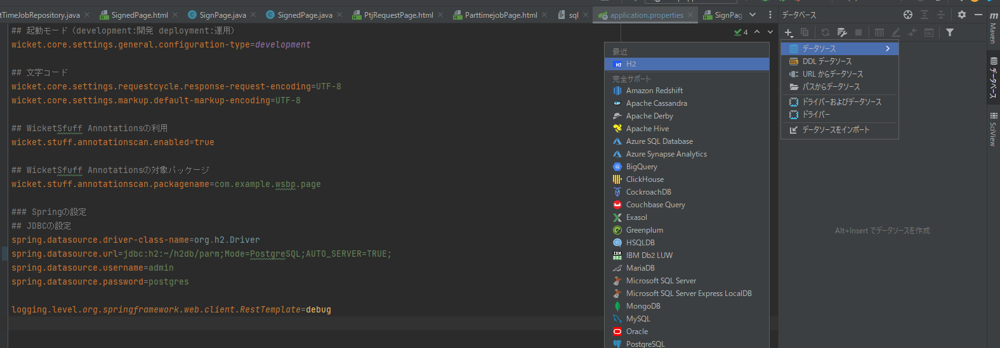
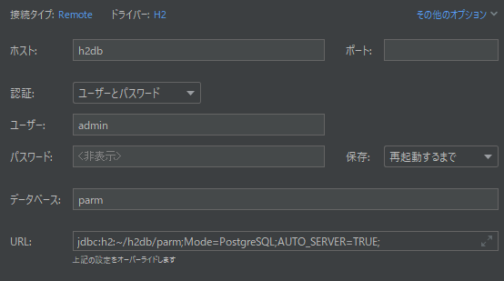
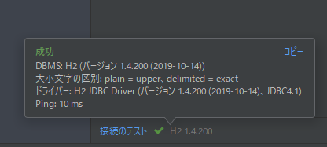
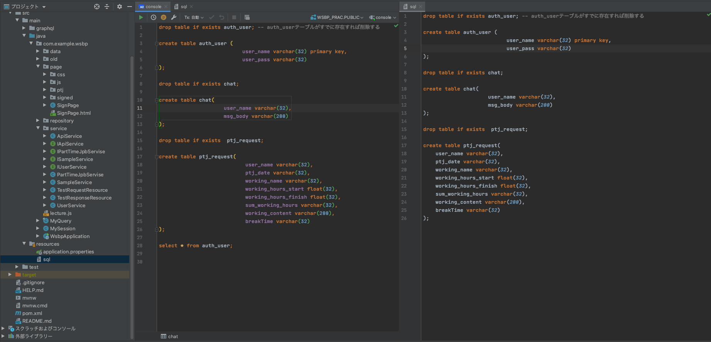

# 学内バイトシステム

- TA/SA業務などの学生アルバイトに関わる諸手続きを支援することを目的としたシステム
- プロジェクトメンバー活動で2020年度から開発継続中

## 概要

後日追記予定

### 2021年度の成果物

- 本リポジトリのソースコード一式
- ヒアリング内容をまとめたドキュメント（GoogleドライブのURLを追加予定）
- 前年度までの成果物は以下を参照

### 2020年度までの成果物

- parm-s : 学生向けアプリのプロトタイプ（-2020）
- core : WEB-API（2021）
- 過去のプロジェクトの成果物はold-project-files内のファイルをダウンロードしてください

## プロジェクトの構成

後日記述予定

## ブランチの運用方針

後日記述予定

## 動作確認とデータベースの構築（2022年2月現在）

1. 各自のIntelliJのトップ画面で「リモートリポジトリをクローン」を選択し、本リポジトリをローカルへクローンする
2. 画面右側の「データベース」を開き、「+ボタン → データソース → H2」の順に選択
   
3. ユーザー名、パスワード、URLを入力（各値はapplication.propertiesを参照）
   
4. 接続テストを行い接続が確立されたらOKをクリックする
   
5. resources内のsqlファイルに記載されているSQL文をデータベースコンソールで実行し、各種テーブルの作成を行う
   

tips

[Clean Architectureにおいてバリデーションはどこでやるべきか](https://ikenox.info/blog/validation-in-clean-arch/)
[バリデーションを再考する](https://hikouki.hateblo.jp/entry/2019/05/31/164944)
[【やさしいDDD入門 第２章】エンティティとは](https://developers-book.com/2021/11/03/694/#:~:text=%E5%80%A4%E3%82%AA%E3%83%96%E3%82%B8%E3%82%A7%E3%82%AF%E3%83%88%E3%81%A8%E5%90%8C%E3%81%98%E3%81%8F%E3%80%81%E3%81%96%E3%81%A3%E3%81%8F%E3%82%8A,%E3%82%AF%E3%83%A9%E3%82%B9%E3%81%A7%E8%A1%A8%E3%81%97%E3%81%9F%E3%82%82%E3%81%AE%E3%80%82)
[ドメイン駆動設計＋クリーンアーキテクチャ解説【DDD編】](https://qiita.com/koh789/items/9d229634991dfac38b0f)
[Wicket AjaxButton onSubmit()でエラーが発生した際の振る舞いを制御する](https://www.monotalk.xyz/blog/Wicket-AjaxButton-Controls-behavior-when-an-error-occurs-onSubmit-method/)
