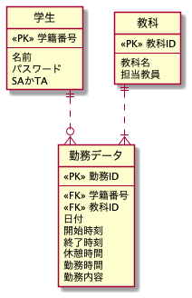

# MVC+DDD

## 1. 構成

```shell
.
├── MySession.java
├── WsbpApplication.java
├── core
│   └── ConfirmationLink.java
├── domain #ドメイン層
│   └── models
│       ├── ptj
│       │   ├── IPartTimeJobRepository.java # DAO(repositoryインターフェース)
│       │   ├── PtjRequest.java # エンティティ
│       │   ├── PtjRowMapper.java # マッパー:Javaオブジェクトとデータベースの間でデータをやりとりする
│       │   └── value # 値オブジェクト
│       │       ├── BreakTimeMinutes.java
│       │       ├── Duties.java
│       │       ├── FinishTime.java
│       │       ├── OfficeHours.java
│       │       └── StartTime.java
│       ├── subject
│       │   ├── ISubjectRepository.java # DAO
│       │   ├── Subject.java # DTO
│       │   └── SubjectRowMapper.java # マッパー
│       └── user
│           ├── IUserRepository.java # DAO
│           ├── User.java # エンティティ
│           ├── UserRowMapper.java # マッパー
│           └── value # 値オブジェクト
│               ├── Name.java
│               ├── Pass.java
│               └── UserType.java # 区分オブジェクト
├── infrastructure # インフラ層
│   ├── repository
│   │   ├── ptj
│   │   │   └── PartTimeJobRepository.java
│   │   ├── subject
│   │   │   └── SubjectRepository.java
│   │   └── user
│   │       └── UserRepository.java
│   └── service
│       ├── IPartTimeJobService.java
│       ├── ISubjectService.java
│       └── IUserService.java
├── page # プレゼンテーション層
│   ├── ParentPage.html
│   ├── ParentPage.java
│   ├── SignPage.html
│   ├── SignPage.java
│   ├── css
│   │   ├── calendar.css
│   │   └── main.css
│   ├── js
│   │   ├── calendar.js
│   │   
│   ├── signed
│   │   ├── SignedPage.html
│   │   ├── SignedPage.java
│   │   └── ptj
│   │       ├── PartTimeJobPage.java
│   │       ├── PartTimejobPage.html
│   │       ├── PtjUpdatePage.html
│   │       ├── PtjEditPage.java
│   │       ├── PtjInsertPage.html
│   │       ├── PtjRequestPage.java
│   │       ├── PtjView.html
│   │       └── PtjView.java
│   └── usermanager
│       ├── UserDeleteCompPage.html
│       ├── UserDeleteCompPage.java
│       ├── UserDeletePage.java
│       ├── UserMakerCompPage.html
│       ├── UserMakerCompPage.java
│       ├── UserMakerPage.html
│       └── UserMakerPage.java
├── service # アプリケーション層
│   ├── ptj
│   │   └── PartTimeJobService.java
│   ├── subject
│   │   └── SubjectService.java
│   └── user
│       └── UserService.java
└── validation
    ├── PtjRequestValidator.java
    └── StudentNumberValidator.java

```

#

|     層      |                        説明                         |
|:----------:|:-------------------------------------------------:|
| プレゼンテーション層 |        リクエストを受け付けたり、レスポンスを返したりと外部をやりとりする層         |
| アプリケーション層  |               プレゼンテーション層とドメイン層の仲介役                |
|   ドメイン層    | ビジネス上の解決すべき問題を表現し、オブジェクトやロジックを含む。ドメイン層は、他の層に依存しない |
|   インフラ層    |    環境に依存するような実装を行う層。データベースとの接続や外部システムとの連携はこの層で実装する  |

### DB構成



## 2. エンティティと値オブジェクト

|   名前    |           説明           |      利用シーン       |
|:-------:|:----------------------:|:----------------:|
| エンティティ  |     一意な識別をもつオブジェクト     | オブジェクト変更の必要があるとき |
| 値オブジェクト | 業務で使う単位のルールを表現するオブジェクト | オブジェクト変更の必要がないとき |

### エンティティの例

### User.java

```java
package com.example.wsbp.domain.models.user;

import com.example.wsbp.domain.models.user.value.Name;
import com.example.wsbp.domain.models.user.value.Pass;
import com.example.wsbp.domain.models.user.value.UserType;
import lombok.Getter;
import java.io.Serializable;

// User Entity
// Wicketの Model に使うかもしれないクラスは、 implements Serializable をつける
// SerializableはDAOと呼ばれるデータベース等ののデータストアを操作するオブジェクトのクラスである
public class User implements Serializable {
    @Getter
    private final String studentNumber;
    private Name name;
    private Pass pass;
    private final UserType type;

    public User(final String studentNumber, final String name,final String pass) {
        this.studentNumber = studentNumber;
        this.name = new Name(name);
        this.pass = new Pass(pass);
        this.type = UserType.whichUserType(studentNumber);
    }

    public String getName() {
        return name.getName();
    }
    public void updateName(final String name){
        this.name = new Name(name);
    }

    public String getPass() {
        return pass.getPass();
    }
    public void updatePass(final String pass){
        this.pass = new Pass(pass);
    }

    public UserType getUserType(){
        return type;
    }
}
```
